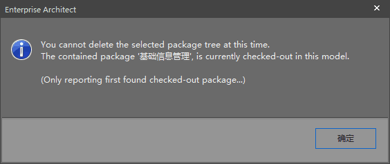

EA项目环境说明：EA工程文件是受SVN版本控制的。

在 `Project Browser` A包右键依次点击  `Package Control`  -> `Check Out` 后，想删除A包下面的B包。在B包上右键点击，在右键菜单中点击`Delete 'B'`后的提示，如下图：

> “基础信息管理” 包被 `Check Out` 了！

如果你也遇到这个问题，请依次检查B包下的已经被 `Check Out` 出来的包（没有🔒图标的包），把找到的包 `Check In` 之后就可以删除 B 包了。也可以直接把 B 包 `Check In Branch...` 后，再删除 B 包。