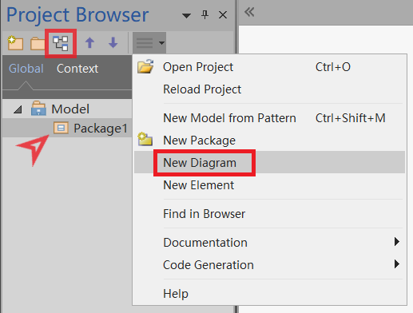
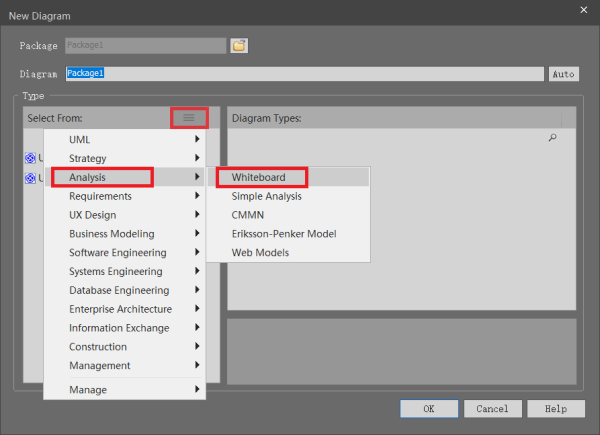
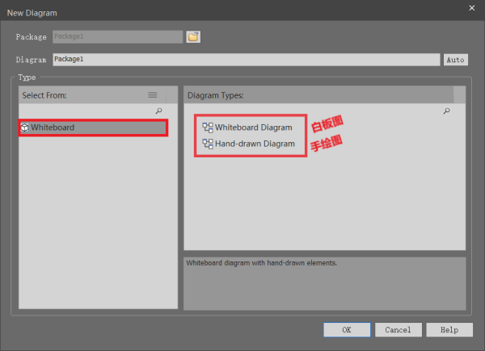
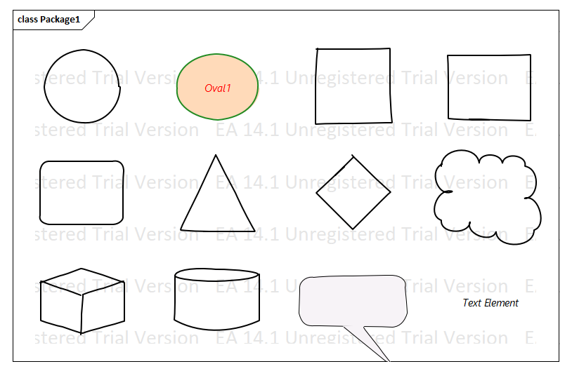
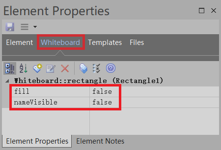

有的时候我们想画画框图用 Visio 是很方便的。可在 Enterprise Architect（后面简称为 EA ）中用什么图画框图比较好呢。有的说用对象图、流程图都可以。我看了下后感觉里面的图形元素和 Visio 框图中的形状还是差了不少。

我就不信 EA 里面连方块、三角、圆都没有！有严重强迫症的我几乎把 EA 中所有的图都看了一遍，终于找个比较接近 Visio 基本框中图形状的图。那就是白板图！！！

# 创建白板图

1. 打开 New Diagram 窗口（注意：不能在 Root Note 下创建图，需要选择个包后才能创建图）

2. 在 New Diagram 窗口中找到白板图

3. 选择白板图或手绘图（随便选什么都行，在图属性中可以随意切换）

# 白板图属性

白板图除了基本的图属性为，还有两个特殊的属性，分别是“手绘”和“白板”

- 手绘：勾选后图中的元素线条会呈现出手绘的效果。
- 白板：勾选后图的背景变为白色，并且图中所有形状的填充色都将显示为白色。

# 图元素

## 工具盒（Toolbox）

## 形状（Shapes）

注意到上图中有个与众不同的形状了吗？

那个就是图中的 Oval1 ，这个形状有两个不同之处：

   1. 显示出了形状的名称；
   2. 不是透明的，有填充色。

在白板图中的形状（Shapes）和箭头（Arrows）有两个通用的属性 fill 和 nameVisible ，分别用来控制是否填充和元素名称的显示，默认都为 false，如下图：

> 注：上面的这两个属性不包括形状中的 Callout 和 Text Element

##  Thin Arrows & Lines

由于 Thin Arrows 和 Lines 元素都比较简单，这里就不在讲述了，自己去探索吧。

