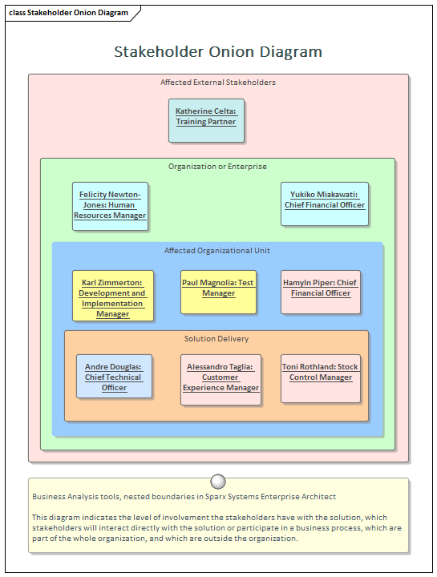
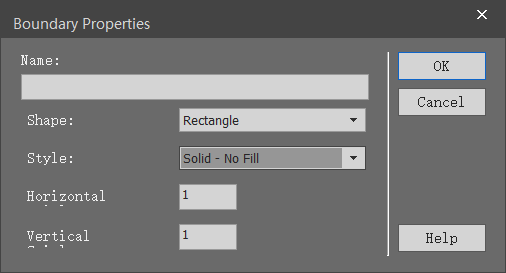

# 什么是边界（Boundary）

边界元素源自用例中的系统边界，但它可以广泛的用在其他地方，用来描述系统或系统中一部分的与其外部环境间的分离方式。可以将任意数量的边界添加到图表中，并且可以将其他元素（例如：用例，特征，需求，组件等）放置在边界内。可以改变边界的属性以显示组织成垂直和水平泳道的多个隔室。边界的边框样式和不透明度也可以设置。

# 什么地方可以找到边界

UML Elements Toolbar | Boundary
Common Toolbox Page | Boundary

# 边界的用法

边界元素对于定义系统内部（或系统的一部分）以及外部内容特别有用。它可用于显示系统或子系统的用例范围内的功能或要求。为管理和非技术受众创建的图表将受益于边界的使用，边界可以着色和嵌套，具有视觉吸引力和商业意义。它本质上是一个图解设备，所以不会出现在项目浏览器中。如果需要正式和结构化的元素分组，建模者可以考虑使用包。

# 边界选项

边界可以设置为有多个垂直和水平泳道，这对于将元素分组到边界的不同部分非常有用，从而创建矩阵效果。边框样式也可以配置为允许使用标准元素外观设置进行着色的不同线条样式。此外，选择“实心”选项可以设置边界的填充颜色。

